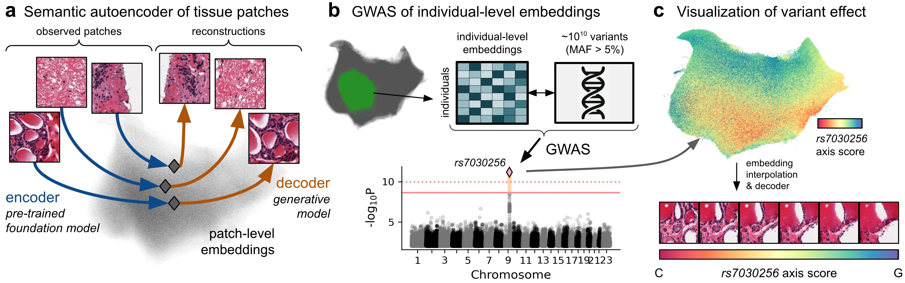

# HistoGWAS Release

Code and job scripts for reproducing the HistoGWAS analyses: slide preprocessing,
encoder selection, genome-wide association, and downstream characterisation.

Preprint: [HistoGWAS: An AI Framework for Automated and Interpretable Genetic Analysis of Tissue Phenotypes](https://www.biorxiv.org/content/10.1101/2024.06.09.597752v3)

Please raise an issue for questions and bug reports.



## Install
The bundled `histogwas` package can be installed in editable mode from the
repository root:

```bash
pip install -e .
```

If you need the optional chi-square stack (`chi2comb`) used by GWAS workflows,
install the extra after setup:

```bash
pip install -e ".[chi2]"
```

After installation, utilities are available via:

```bash
from histogwas import emb_gwas, vctest
```

## Repository Layout
- `histogwas/` – installable package bundling Emb-GWAS, genotype utilities, and
  shared helpers.
- `scripts/preprocessing/` – Stage 1–3 preprocessing drivers with per-step
  READMEs and Slurm launchers.
- `scripts/encoder_selection/` – TPM filtering and gene-prediction evaluation
  across histology encoders.
- `scripts/generative_decoder/` – optional generative modelling utilities.
- `scripts/gwas/` – Emb-GWAS association drivers and cluster-wise launchers.
- `scripts/downstream_characterization/` – colocalization, cluster signatures, gene prediction
  summaries.

Each script directory documents its own CLI arguments and expected inputs.

## Getting Started
1. Create the relevant conda environment, then install the `histogwas` package.
2. Adjust path constants (for example `OUTPUT_ROOT`) in the `*_run.py` launchers
   to match your storage layout.
3. Submit jobs with the provided Slurm wrappers or run scripts directly as
   outlined in their local READMEs.

## Citation
```
@article{chaudhary2024histogwas,
  title={HistoGWAS: An AI-enabled Framework for Automated Genetic Analysis of Tissue Phenotypes in Histology Cohorts},
  author={Chaudhary, Shubham and Voigts, Almut and Bereket, Michael and Albert, Matthew L and Schwamborn, Kristina and Zeggini, Eleftheria and Casale, Francesco Paolo},
  journal={bioRxiv},
  pages={2024--06},
  year={2024},
  publisher={Cold Spring Harbor Laboratory}
}
```
